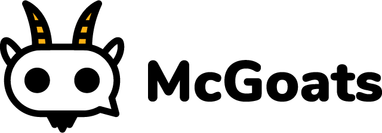

# McGoats

McGoats is a discord bot for the Totes discord server built by [Remi](https://www.twitter.com/ctrlaltcookie) for adding missing discord functionality, memes and assisting in roleplaying games.

## Build

You can build the project with `make`

```bash
$ make prepare
```

Or if you are on linux without `make`:

```bash
$ npm install
$ mkdir -p data
$ echo "{}" > ./data/savestate.json
$ echo "module.exports = 'your key here'" > ./api/token.js
```

I don't have a script for building on windows, because windows is terrible.

## Tests

Tests are written run with [Labjs](https://github.com/hapijs/lab), assertions are from [Code](https://github.com/hapijs/code), with mocking from [Sinon](https://sinonjs.org/).

You can run tests with

```bash
$ make test
```

Or if you don't have make because you're on windows:

```bash
$ npm test
```

Or if you want to add arguments to the test runner:

```bash
$ ./node_modules/.bin/lab -c -m -something -readTheDocumentation
```

## Runnage

You can run the bot either with `make` if it's available, the default target is to run the project:

```bash
$ make

or

$ make run
```

Or if you are on windows:

```bash
$ npm start

or

$ node index.js
```

I'd suggest using a process manager if you are intending to use this code in production, such as [pm2](https://www.npmjs.com/package/pm2)! You'll need to add a `./token` folder or file that contains your auth token.

## Api Features

McGoats uses the classic bang (!) style command system, this means that it will be incompatible with any other bot or game that uses the same structure for commands.

### Goodgoat / Badgoat

The bot starts off as grey, sitting as neither good nor bad, you can use !goodgoat and !badgoat to shift the tiller toward the goat being a positive or negative force on your server. This is useful for figuring out if the goat is having any kind of positive or negative influence over time, to help you decide on whether you want to keep the goat or not.

Use !balance or !count to find out how the goat is doing.

### Role colour

!colour #97dbc8 will let you change the colour of your role, this is an easy way of letting people self manage the colour of their role, as the functionality for this is normally locked away at the higher levels of moderation.

### Help

You can use !commands or !help to display a list of the commands available and examples of their usage.

### Hangman

Use !hangman to start a game of hangman, where you use !a bang + letter to guess a letter and can use !fullword to guess the fullword. It's fully interactive and anyone can join in, at the moment you can't have a single player game and scores aren't kept.

## Upcoming features

* talk as bot feature!
* Score! - Yeah! Adding scores to things, so that you can like, build up score and use it to do things, relies on persistence existing
* Hangman !fullword penalties - !fullword is OP, you need to spend some score to use it and if you get it wrong will not be allowed to !fullword again for the rest of this hangman session, it gives more score the earlier used, and is worth the same as a win when used 1 letter away from the end.
* The feeding game! - The goat is hungry, feed it, everyone who feeds it within a time limit gets some score.
* The petting game - The goat is sad, pet it, the first person to pet the goat gets score, if you react too slow, it'll kick you and you'll lose score :o CAREFUL!
* Leaderboards! - which will show score, this can't be implemented until we have the second game
